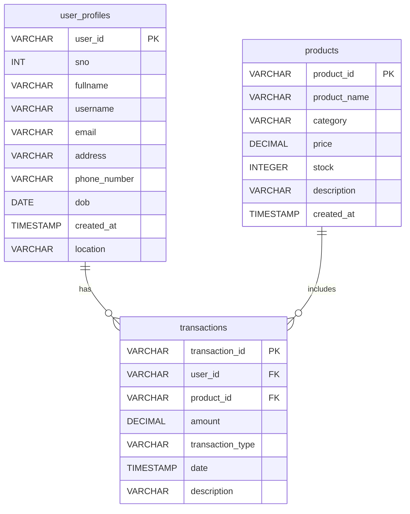
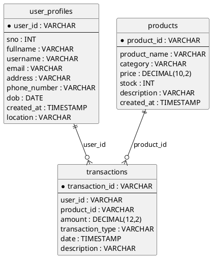

# Data Schema Documentation

This document provides a human-friendly overview of the logical data model generated by `generate_data.py`.

## Quick View (PNG)
If you have an exported PNG already, it will render below:


## Mermaid ER Diagram
Copy/edit as needed. GitHub renders Mermaid automatically.


## PlantUML Version (Alternative)
If you prefer PlantUML:


## Column Reference
| Table | Column | Type | Notes |
|-------|--------|------|-------|
| user_profiles | user_id | VARCHAR | Primary key (UUID) |
| user_profiles | sno | INT | Sequential row number (1..N) |
| user_profiles | fullname | VARCHAR | Faker name |
| user_profiles | username | VARCHAR | Faker username (not unique) |
| user_profiles | email | VARCHAR | Faker email (not unique) |
| user_profiles | address | VARCHAR | May contain newlines |
| user_profiles | phone_number | VARCHAR | Regional formats |
| user_profiles | dob | DATE | 18–90 years old |
| user_profiles | created_at | TIMESTAMP | Random past decade |
| user_profiles | location | VARCHAR | City |
| products | product_id | VARCHAR | Primary key (UUID) |
| products | product_name | VARCHAR | Single capitalized word |
| products | category | VARCHAR | Electronics/Clothing/Books/Toys |
| products | price | DECIMAL(10,2) | 10–1000 |
| products | stock | INT | 0–500 |
| products | description | VARCHAR | Up to 200 chars |
| products | created_at | TIMESTAMP | This year |
| transactions | transaction_id | VARCHAR | Primary key (UUID) |
| transactions | user_id | VARCHAR | FK → user_profiles.user_id |
| transactions | product_id | VARCHAR | FK → products.product_id |
| transactions | amount | DECIMAL(12,2) | 10–10000 |
| transactions | transaction_type | VARCHAR | Credit or Debit |
| transactions | date | TIMESTAMP | This year |
| transactions | description | VARCHAR | Short sentence |

## Regenerating `schema.png`
Choose one approach.

### 1. Mermaid CLI
```bash
# Install (Node.js required)
npm install -g @mermaid-js/mermaid-cli
# Save mermaid block above into schema.mmd
mmdc -i schema.mmd -o schema.png
```

### 2. PlantUML (Docker)
```bash
docker run --rm -v "$(pwd)":/workspace plantuml/plantuml -tpng schema.puml
```

### 3. dbdiagram.io
Paste the dbdiagram DSL from `schema.txt` into https://dbdiagram.io and export as PNG.

## Notes
- Foreign keys are logical (DuckDB ignores FK constraints). Integrity comes from how IDs are chosen in code.
- All data is synthetic and non-sensitive.

_Last updated: 2025-09-09_
